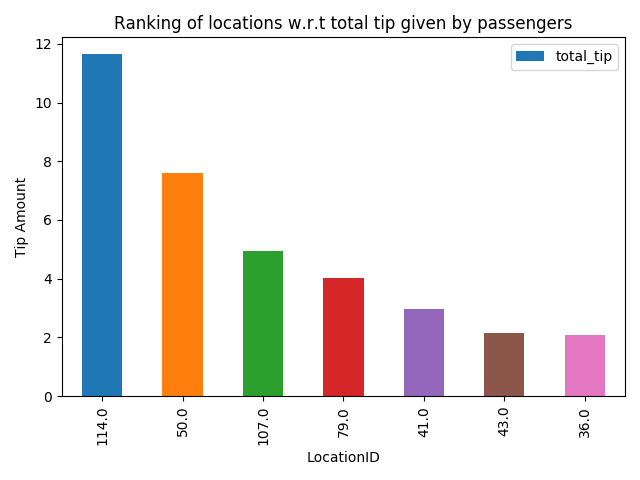

# Assignment 3 801649

This is a implementation of a Streaming Analytics System using `Apache Flink`. 

## Design

## Output
Near-Realtime Output            |  Batch analytics on RT output 
:-------------------------:|:-------------------------:
 |  

---
## Deployment

For Deployment guidelines click [here](reports/Assignment-3-Deployment.md)

## Design Details

For viewing the design details of the system click [here](reports/Assignment-3-Design.md)

## Built With

* [Flink](https://flink.apache.org/) - As Streaming Framework
* [Kafka](https://kafka.apache.org/) - As Message Broker
* [Elasticsearch](https://www.elastic.co/products/elasticsearch) - As Final Sink
* [Kibana](https://www.elastic.co/products/kibana) - Visualizing outputs
* [Redis](https://redis.io/) - As near-realtime Sink

## Author

* **Kibria Shuvo** [github](https://github.com/kibriashuvo)

## Acknowledgments

* Lecture materials of **Hong-Linh Truong** [Website](https://users.aalto.fi/~truongh4/) 
* **Tyler Akidau** [Streaming 101](https://www.oreilly.com/ideas/the-world-beyond-batch-streaming-101)
