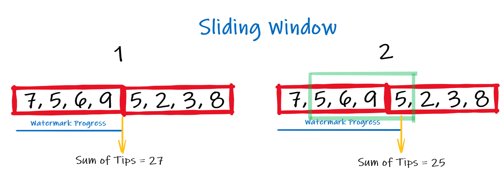

## Part 1: Design for Streaming Analytics


**Q1:** *Select a dataset suitable for streaming analytics for a customer as a running example (thus the basic unit of the data should be a discrete record/event data). Explain the dataset and at least two different analytics for the customer: (i) a streaming analytics which analyzes streaming data from the customer (customerstreamapp) and (ii) a batch analytics which analyzes historical results outputted by the streaming analytics.* 

**Answer:** 

I used the New York City (NYC) Taxi [dataset](https://www1.nyc.gov/site/tlc/about/tlc-trip-record-data.page) published by NYC Taxi and Limousine Corporation (TLC). 

Particularly, I have used the dataset for yellow taxi cabs for the month *January, 2019*. The data is available in CSV format, where **each row of the CSV file represents a taxi ride event** in NYC. 
The dataset that I have used here contains in total 18 fields of which we are mostly interested in the following fields - 

* **tpep_dropoff_datetime** - When the meter was disengaged
* **PULocationID** - Pickup location ID
* **tip_amount** - The amount of tip given by the passenger by credit card payment

(Note: A list of the explanation of each individal fields can be found [here](https://data.cityofnewyork.us/api/views/t29m-gskq/files/89042b9b-8280-4339-bda2-d68f428a7499?download=true&filename=data_dictionary_trip_records_yellow.pdf))

Previously, this dataset used to include the latitude and longitude of the pickup and dropoff locations, but in the latest versions they have removed these attributes. Instead they are providing locationID (1 through 263) from the pickup and dropoff locations as they have divided the whole NYC into 263 locations. However, a [geoJSON format](https://geo.nyu.edu/catalog/nyu-2451-36743) of the 263 zones can be found in the Spatial Data Repository of **New York University (NYU).**

**Streaming analytics:**

The taxi drivers might be interested in finding the pickup areas of those rides, in which the passagers usually gives more **tips**. So, here I'm going to develop a streaming analytics for the **taxi drivers or a company devloping an app for the drivers (my customers)**, where they will be able to see the status quo of total tip amount paid by the passengers for the rides which started in these pickup location. So that, if a driver wishes, he can go to such vicinties in the hope of earning more based on the idea that these areas might have more corporate offices or the passagers living in these areas are relatively rich and generous. 

To be more clear, the taxi drivers will be able see the **top n** (my customer defines the **n**) pickup locations which resulted into highest total tips, updating in near real-time.

**Batch analytics from the historical output of Streaming analytics:**


Here again my customers will be able to see the pickup locations of the taxi rides which resulted into maximum tips but as this analysis will be generated from the **bounded data** generated by my streming analytics output, my customers will have the freedom of seeing this batch analytics results based on their specified time-frame (i.e. daily, weekly, monthly etc).

Moreover, I will plot the result of this batch analytics onto a **co-ordinate map**, to make this analytics intutive and easy to understand for my customers.


**Q2:** *Customers will send data through message brokers/messaging systems which become data stream sources. Discuss and explain the following aspects for the streaming analytics: (i) should the analytics handle keyed or non-keyed data streams for the customer data, and (ii) which types of delivery guarantees should be suitable.*

**Answer:**

**i.** The streaming analytics that I am implementing here should handle **keyed** data stream. Because, the analytics is going to calculate total amount tips of all the taxi rides starting from a particular pickup location. In order to calculate this, the data stream must be keyed by the pickup location id **(PULocationID)**, so that the incoming taxi ride events will be partioned by their **(PULocationID)** and the output of the streaming analytics for each of these locations will be calculated parallelly.


For example, in the diagram above, I am receiving the taxi ride events from the Kafka source and then passing it through the **KeyBy Operator** which eventually allocates them to the **Window Operators**. In the diagram the taxi ride events **R<sub>1</sub>** through **R<sub>6</sub>** are colored according to their location ID. After passing through the keyBy Operator they are **partitioned** according to their pickup location ID and then they are passed to appropiate window operator. Then each of these window operators **materializes** the result of streaming analysis parallelly **when** at proper time (The discussion about timing of window matrialization is discussed in answer of question no. 3).


**ii.** **At-most-once** delivery guarantee should be suitable for my streaming analytics. Because, I don't really want to process a single taxi ride event multiple times and get a **false** high total_tip amount which might mislead the taxi drivers to choose wrong pick-up locations.

On the other hand, the events that I am handling in this analytics *is **not** something that actually requires At-least-once delivery guarantee*, because I want to provide the drivers an opportunity to earn more, but it is not something that will affect their normal earnings. Yes, they might earn more if I can provide the exact updated realtime analytics, but missing couple of taxi ride events won't hurt them as much as would if I process a single taxi ride event multiple times and produce a wrong (misleading) output.

But definately, my ultimate target is to provide exactly-once delivery. 


**Q3:** *Given streaming data from the customer (selected before). Explain the following issues: (i) which types of time should be associated with stream sources for the analytics and be considered in stream processing (if the data sources have no timestamps associated with events, then what would be your solution), and (ii) which types of windows should be developed for the analytics (if no window, then why). Explain these aspects and give examples.* 


**Answer:**

**i.** The particular streaming analytics that I'm implementing here requires consideration of **event time**. Because, here I'm computing the total amount of tips per pickup location and presenting the ouput to my customers (taxi drivers) in near-realtime, so that the drivers can go these vicinities to find such a trip in the hope of more earnings. 

The necessity of providing my customers with **accurate analysis** is the reason behind considering **event time** during processing. 

Let's assume a scenario where my stream processing system receives a taxi ride event (in current time) with a very high amount of tip but actually the ride was taken on the day before (**a late and out-of-order data event by a huge margin**). If my system considers **ingestion time** for the data events, then this late and out-of-order event will be considered as a freshly ended taxi ride and the generous tip amount will be aggegated to the running sum of the window for this location. In worst case, this sum will be greater than the **n<sup>th</sup>** highest sum and this location would pop up as a highly rewarding pickup location in driver's near-realtime output window. So, naturally the driver would be tempted to pick up passengers from this location expecting to earn more, but in reality this location is not one of those desired pick-up locations. Subsequently, in this case the driver is losing the opportunity of earning more by coming to this location **false** rewarding location instead of going to a location which is actually rewarding (in terms of earning more tips).

This dataset contains two timestamp fields: **tpep_pickup_datetime & tpep_dropoff_datetime**. As we all know, duration of each of the taxi rides vary, so for 2 rides starting one after another it is not guaranteed that the ride which started earlier would necessarily finish earlier than the other. So, we can't consider the *pickup time* as our event time. Instead, we are considering **tpep_dropoff_datetime** as our event time to provide streaming analytics on freshly ended taxi ride events. 


**ii.** **Sliding windows** should be developed as my analytics will present the drivers with a regularly updated graph of the most rewarding locations in terms of higher total tips. So, while computing this total tips the streaming app should always consider the most recently ended taxi rides and produce the output at low-latency (by triggering the **materialization** of the windows as soon as possible) and at the same time maintain a **continuum** the results, both of which are provided by **Sliding windows** of time.

Following example will demonstrate why it is important to maintain a continuum while of event stream in my streaming analytics (calculating the total tips per location).


In the first case, we are considering *tumbling windows* of 4 seconds, where the sum of the tips are being materialized at the end of each window. Additionally, there is a trigger which fires whenever a new taxi ride event arrives. Now, at the end of 4th second the first window will be materialized and the sum of the tips will be **27**. Then the 2nd window starts and another taxi ride event with tip amount 5 arrives. But, as we had defined a trigger which fires on the arrival of a new element, that trigger will fire now and the result for the new window will be materialized and the sum of the tips will be **5**, which is not what we want.



Now, lets consider the same example with sliding window. Here, again we have window width of 4 seconds which slides by 1 seconds and a trigger which fires at a new element arrival. Now for at the end of the first window the sum will be same as the tumbling window which is **27**. But, this time when the next taxi ride with tip amount 5 arrives another overlapping sliding window (green in the figure) will be materialzed as the watermark will pass the end of this window by this time and the sum of the tips will be **25**, which is the exact output that we desire.

Thus, I'm using sliding window for my streaming analytics. 

For example my analytics will be computing total tips for each location for the past 15 mins computed in every 5 mins. A new window will be created in every 5 mins, and each of this windows will contain the taxi ride events recieved in last 15 mins.....

overlap
Result materialization


**Q4:** Explain which performance metrics would be important for the streaming analytics for your customer cases

**Answer:**

Among the two most important performance metrics (*latency* and *throughput*) of stream processing systems, **throughput** would be most relavant metric for my customers.

The reason behind this is that my customers want to see a list of the most rewarding pick-up locations in terms of tips earned by the end of these rides. In other words, they want the see the statistics of tip amount grouped by pick-up locations. As we know from the **Central Limit Theorem**, the confidence in the estimate is proportional to sample size. Namely, as the sample increases, so does the confidence in the estimate that we calculate, which in terms results into lower uncertainty and higher precision. 

So, for this streaming analytics to be reliable for my customers, it has make sure that it processes event streams with high throughput. Because, high throughput will ensure **higher reliablity** of the result that we disseminate back to our customer. Because, then my customers would be assured that a pick-up location with high tip amount (result of the streaming analytics) is actually rewarding, as it was computed by processing a substantial number of taxi ride events. Otherwise stated, high throughput will ensure that the result is not skewed by any outlier (i.e. a single taxi ride with a remarkably high amount of tip).

Although, by no means, the analysis above implies that *latency* is not an important metric for my customers. As for any streaming analytics application the goal is to achieve lower latency and higher throughput. But in case of my streaming analytics the importance of **throughput** outweighs *latency*. 

**Q5:** *Provide a design of your architecture for the streaming analytics service in which you clarify: customer data sources, mysimbdp message brokers, mysimbdp streaming computing service, customer streaming analytics app, mysimbdp-coredms, and other components, if needed.*

**Answer:**


blah blah blah

---


## Part 2: Implementation of streaming analytics

**Q1:** *Explain the implemented structures of the input streaming data and the output result, and the data serialization/deserialization, for the  streaming analytics application (customerstreamapp) for customers.*


**Answer**

All codes related to the streaming analytics are located inside [code/customer-code](../code/customer-code) directory.
* The **customerstreamapp** is located inside [code/customer-code/customerstreamapp](../code/customer-code/customerstreamapp) directory.
* We are using the downloaded dataset in CSV format to imitate realtime streaming data. This data stream is generated by [customer_producer.py](../code/customer-code/customer_producer.py)
The input streaming data is the exact JSON representation of each taxi ride event.
* Finally, when **customerstreamapp** outputs results to the Redis sink, [customer_realtime-view.py](../code/customer-code/customer_realtime-view.py) polls the total tip for each of the locations continously to show the near-realtime output to the customer. 

**Structure of input streaming data:**


The input streaming data is actually the entire row of in the dataset which represents a taxi ride event. So, here [customer_producer.py](../code/customer-code/customer_producer.py) is reading the CSV file into a Dataframe in *Pandas* and then converting each row to a JSON object. Finally it **serializes** the newly created JSON object and sends it to the **customerstreamapp-input** topic of **mysimbdp-databroker** (`Kafka`).

My stream processing service is also capable of handling **event stream** directly from the taxi's IoT device if one is installed, as long as it streams the event data in the same format described above which is a serialized JSON object that is later converted into a **POJO** using a deserializer by **customerstreamapp**. 

**Structure of output result:**

The **customerstreamapp** has 2 **Event sinks**, one for near-realtime output (`Redis `) and the other for storing streaming output results (`elasticsearch`) for performing batch processing later on. 

1. The output for near-realtime results is a Tuple of 2 **(location_id,total_tip)**. This output is stored in `Redis` as key-value pairs. To provide my customers with a visual aid to understand the output, [customer_realtime-view.py](../code/customer-code/customer_realtime-view.py) polls the total tip for each of the locations continously to show the near-realtime output to the customer using *matplotlib*.  


2. The output for storing batch result is a JSON string consisting of 4 fields (time,location_id,location,total_tip) where *time* is ending timestamp of the window, *location_id* is the pick-up location of the rides in this current window, *location* is the geo_point (longitude,latitude) of the corresponding location_id and *total_tip* is the result of the window. Below is an example:
```
{
    "time": "153130931300",
    "location_id": "176",
    "location": "40.689483,-74.171533",
    "total_tip": "12.78"
}
```


**Serialization/deserialization of Customerstreamapp:**

On the other end, **customerstreamapp** has a class called [TaxiRideEvent.java](../code/customer-code/customerstreamapp/src/main/java/com/kibria/TaxiRideEvent.java) which represents a taxi ride event inside the customerstreamapp. It has the exact same 18 attibutes as the JSON object sent by [customer_producer.py](../code/customer-code/customer_producer.py). 


**Customerstreamapp** has a **deserializer** class [TaxiRideSerializer.java](../code/customer-code/customerstreamapp/src/main/java/com/kibria/TaxiRideSerializer.java) which takes the JSON string read from `Kafka` topic and converts it to a **POJO** (TaxiRideEvent in this case).


**Q2:** Explain the key logic of functions for processing events/records in customerstreamapp in your implementation

**Answer:**

My streaming analytics application uses `Apache Flink` as its stream processing engine and I used Java to implement a DataStream program using Flink's [*DataStream API*](https://ci.apache.org/projects/flink/flink-docs-release-1.9/dev/datastream_api.html), where data streams are generated from various sources and the results are returned via sinks. 

1. In my **customerstreamapp** first we define a new *StreamExecutionEnvironment* and then configure it to consider *Event time* for processing the event stream. 


2. Then we configure a `Kafka` consumer namely *FlinkKafkaConsumer011* and subcribe to the topic 
*customerstreamapp-input*. We also pass our deseializer class *TaxiRideSerializer* to the consumer so that it can deserialize the JSON event stream to convert them into POJO. This completes our event stream source setup and we get a *DataStream* of *TaxiRideEvents*.


3. Next we define the process of generating **Watermarks** for the *DataStream* that we had just created.

The class *MyExtractor* is called for generating these **Watermarks**, which is extracted from the *Dropoff time** of the taxi events. Here I can also specify (in the constructor) the amount of lateness allowed before the window is materialized.


4. After that, I key the *DataStream* using location_id of the events and then assign them to a **sliding window** of 1 hour which slides by 30 minutes (Tests will include results of varting window size). I include a **trigger** which fires whenever a new event arrives in the window. Finally I pass the *DataStream* through a reduce function which processes the event stream. 


5. As it can be seen from the last line of the screenshot above, for **materialization** of each window, I have used a combination of `ProcessWindowFunction` and `ReduceFunction` because it allowed me to process the *DataStream* via *Incremental Aggregation*. 
    By default, `ProcessWindowFunction` *materializes* the window in a batch fashion, where it performs the desired operation on the window contents which is passed to it in an `Iterable`. The downside of this policy is that the window contents need to be buffered, which is memory intensive. 

    So, by using a combination of `ReduceFunction` and `ProcessWindowFunction`, I am eliminating the overhead of buffering window contents in the following manner. 
    
    1. Whenever a new *TaxiRideEvent* arrives the it is reduced by calling the *reduce()* method of *ReduceBySummingTip* class. So, we now we only need to store a reduced single object in the memory instead of buffering them up.
    

    2. So, now there will be only one object in the `Iterable` of the *TotalTipForThisWindow* (`ProcessWindowFunction`) class. So, while window *materialization*, we can get the first object in the iterable and publish the result for this window. 
    The result here is a Tuple of 3 elements (key, Sum of Tips, ending timestamp of the window).
     

6. Instead of providing the customers with a Tuple of 3 elements, I wanted to show them something more intuitive. So, I used `Redis` as my near-realtime sink, which can be queried by the [customer_realtime-view](../code/customer-code/customer_realtime-view.py) app to produce a near-realtime ranking of the **n** most rewarding pick-up locations in terms of earning tips. The resultant image is stored in [reports/near-realtime_results](near-realtime_results/) directory.


As `Redis` is a key-value store, so I mapped the initial Tuple3 output to Tuple2<Sring,String> where *"L"+location_id* is the key and *total_tip* is the value to be stored in `Redis`. 


Finally we execute our *StreamExecutionEnvironment* env.


