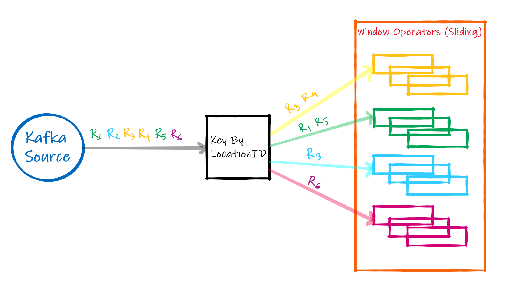
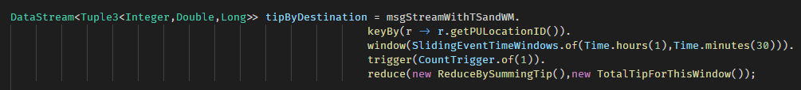
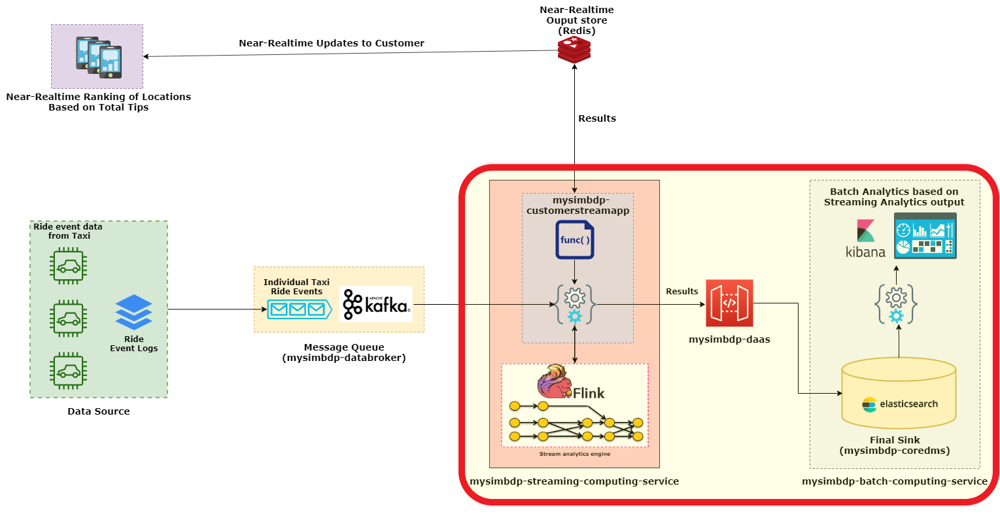

## Part 1: Design for Streaming Analytics


**Q1:** *Select a dataset suitable for streaming analytics for a customer as a running example (thus the basic unit of the data should be a discrete record/event data). Explain the dataset and at least two different analytics for the customer: (i) a streaming analytics which analyzes streaming data from the customer (customerstreamapp) and (ii) a batch analytics which analyzes historical results outputted by the streaming analytics.* 

**Answer:** 

I used the New York City (NYC) Taxi [dataset](https://www1.nyc.gov/site/tlc/about/tlc-trip-record-data.page) published by NYC Taxi and Limousine Corporation (TLC). 

Particularly, I have used the dataset for yellow taxi cabs for the month *January, 2019*. The data is available in CSV format, where **each row of the CSV file represents a taxi ride event** in NYC. 
The dataset that I have used here contains in total 18 fields of which we are mostly interested in the following fields - 

* **tpep_dropoff_datetime** - When the meter was disengaged
* **PULocationID** - Pickup location ID
* **tip_amount** - The amount of tip given by the passenger by credit card payment

(Note: A list of the explanation of each individal fields can be found [here](https://data.cityofnewyork.us/api/views/t29m-gskq/files/89042b9b-8280-4339-bda2-d68f428a7499?download=true&filename=data_dictionary_trip_records_yellow.pdf))

Previously, this dataset used to include the latitude and longitude of the pickup and dropoff locations, but in the latest versions they have removed these attributes. Instead they are providing locationID (1 through 263) from the pickup and dropoff locations as they have divided the whole NYC into 263 locations. However, a [geoJSON format](https://geo.nyu.edu/catalog/nyu-2451-36743) of the 263 zones can be found in the Spatial Data Repository of **New York University (NYU).**

**Streaming analytics:**

The taxi drivers might be interested in finding the pickup areas of those rides, in which the passagers usually gives more **tip**. So, here I'm going to develop a streaming analytics for the **taxi drivers or a company devloping an app for the drivers (my customers)**, where they will be able to see the status quo of total tip amount paid by the passengers for the rides which started in these pickup location. So that, if a driver wishes, he can go to such vicinties in the hope of earning more based on the idea that these areas might have more corporate offices or the passagers living in these areas are relatively rich and generous. 

To be more clear, the taxi drivers will be able see the **top n** (my customer defines the **n**) pickup locations which resulted into highest total tip, updating in near real-time.

**Batch analytics from the historical output of Streaming analytics:**


Here again my customers will be able to see the pickup locations of the taxi rides which resulted into maximum tip but as this analysis will be generated from the **bounded data** generated by my streming analytics output, my customers will have the freedom of seeing this batch analytics results based on their specified time-frame (i.e. daily, weekly, monthly etc).

Moreover, I will plot the result of this batch analytics onto a **co-ordinate map**, to make this analytics intutive and easy to understand for my customers.


**Q2:** *Customers will send data through message brokers/messaging systems which become data stream sources. Discuss and explain the following aspects for the streaming analytics: (i) should the analytics handle keyed or non-keyed data streams for the customer data, and (ii) which types of delivery guarantees should be suitable.*

**Answer:**

**i.** The streaming analytics that I am implementing here should handle **keyed** data stream. Because, the analytics is going to calculate total amount tip of all the taxi rides starting from a particular pickup location. In order to calculate this, the data stream must be keyed by the pickup location id **(PULocationID)**, so that the incoming taxi ride events will be partioned by their **(PULocationID)** and the output of the streaming analytics for each of these locations will be calculated parallelly.


For example, in the diagram above, I am receiving the taxi ride events from the Kafka source and then passing it through the **KeyBy Operator** which eventually allocates them to the **Window Operators**. In the diagram the taxi ride events **R<sub>1</sub>** through **R<sub>6</sub>** are colored according to their location ID. After passing through the keyBy Operator they are **partitioned** according to their pickup location ID and then they are passed to appropiate window operator. Then each of these window operators **materializes** the result of streaming analysis parallelly **when** at proper time (The discussion about timing of window matrialization is discussed in answer of question no. 3).


**ii.** **At-most-once** delivery guarantee should be suitable for my streaming analytics. Because, I don't really want to process a single taxi ride event multiple times and get a **false** high total_tip amount which might mislead the taxi drivers to choose wrong pick-up locations.

On the other hand, the events that I am handling in this analytics *is **not** something that actually requires At-least-once delivery guarantee*, because I want to provide the drivers an opportunity to earn more, but it is not something that will affect their normal earnings. Yes, they might earn more if I can provide the exact updated realtime analytics, but missing couple of taxi ride events won't hurt them as much as would if I process a single taxi ride event multiple times and produce a wrong (misleading) output.

But definately, my ultimate target is to provide exactly-once delivery. 


**Q3:** *Given streaming data from the customer (selected before). Explain the following issues: (i) which types of time should be associated with stream sources for the analytics and be considered in stream processing (if the data sources have no timestamps associated with events, then what would be your solution), and (ii) which types of windows should be developed for the analytics (if no window, then why). Explain these aspects and give examples.* 


**Answer:**

**i.** The particular streaming analytics that I'm implementing here requires consideration of **event time**. Because, here I'm computing the total amount of tip per pickup location and presenting the ouput to my customers (taxi drivers) in near-realtime, so that the drivers can go these vicinities to find such a trip in the hope of more earnings. 

The necessity of providing my customers with **accurate analysis** is the reason behind considering **event time** during processing. 

Let's assume a scenario where my stream processing system receives a taxi ride event (in current time) with a very high amount of tip but actually the ride was taken on the day before (**a late and out-of-order data event by a huge margin**). If my system considers **ingestion time** for the data events, then this late and out-of-order event will be considered as a freshly ended taxi ride and the generous tip amount will be aggegated to the running sum of the window for this location. In worst case, this sum will be greater than the **n<sup>th</sup>** highest sum and this location would pop up as a highly rewarding pickup location in driver's near-realtime output window. So, naturally the driver would be tempted to pick up passengers from this location expecting to earn more, but in reality this location is not one of those desired pick-up locations. Subsequently, in this case the driver is losing the opportunity of earning more by coming to this location **false** rewarding location instead of going to a location which is actually rewarding (in terms of earning more tip).

This dataset contains two timestamp fields: **tpep_pickup_datetime & tpep_dropoff_datetime**. As we all know, duration of each of the taxi rides vary, so for 2 rides starting one after another it is not guaranteed that the ride which started earlier would necessarily finish earlier than the other. So, we can't consider the *pickup time* as our event time. Instead, we are considering **tpep_dropoff_datetime** as our event time to provide streaming analytics on freshly ended taxi ride events. 


**ii.** **Sliding windows** should be developed as my analytics will present the drivers with a regularly updated graph of the most rewarding locations in terms of higher total tip. So, while computing this total tip the streaming app should always consider the most recently ended taxi rides and produce the output at low-latency (by triggering the **materialization** of the windows as soon as possible) and at the same time maintain a **continuum** the results, both of which are provided by **Sliding windows** of time.

Following example will demonstrate why it is important to maintain a continuum while of event stream in my streaming analytics (calculating the total tip per location).


In the first case, we are considering *tumbling windows* of 4 seconds, where the sum of the tip are being materialized at the end of each window. Additionally, there is a trigger which fires whenever a new taxi ride event arrives. Now, at the end of 4th second the first window will be materialized and the sum of the tip will be **27**. Then the 2nd window starts and another taxi ride event with tip amount 5 arrives. But, as we had defined a trigger which fires on the arrival of a new element, that trigger will fire now and the result for the new window will be materialized and the sum of the tip will be **5**, which is not what we want.


Now, lets consider the same example with sliding window. Here, again we have window width of 4 seconds which slides by 1 seconds and a trigger which fires at a new element arrival. Now for at the end of the first window the sum will be same as the tumbling window which is **27**. But, this time when the next taxi ride with tip amount 5 arrives another overlapping sliding window (green in the figure) will be materialzed as the watermark will pass the end of this window by this time and the sum of the tip will be **25**, which is the exact output that we desire.

Thus, I'm using sliding window for my streaming analytics. 

For example my analytics will be computing total tip for each location for the past 15 mins computed in every 5 mins. A new window will be created in every 5 mins, and each of this windows will contain the taxi ride events recieved in last 15 mins.....

overlap
Result materialization


**Q4:** Explain which performance metrics would be important for the streaming analytics for your customer cases

**Answer:**

Among the two most important performance metrics (*latency* and *throughput*) of stream processing systems, **throughput** would be most relavant metric for my customers.

The reason behind this is that my customers want to see a list of the most rewarding pick-up locations in terms of tip earned by the end of these rides. In other words, they want the see the statistics of tip amount grouped by pick-up locations. As we know from the **Central Limit Theorem**, the confidence in the estimate is proportional to sample size. Namely, as the sample increases, so does the confidence in the estimate that we calculate, which in terms results into lower uncertainty and higher precision. 

So, for this streaming analytics to be reliable for my customers, it has make sure that it processes event streams with high throughput. Because, high throughput will ensure **higher reliablity** of the result that we disseminate back to our customer. Because, then my customers would be assured that a pick-up location with high tip amount (result of the streaming analytics) is actually rewarding, as it was computed by processing a substantial number of taxi ride events. Otherwise stated, high throughput will ensure that the result is not skewed by any outlier (i.e. a single taxi ride with a remarkably high amount of tip).

Although, by no means, the analysis above implies that *latency* is not an important metric for my customers. As for any streaming analytics application the goal is to achieve lower latency and higher throughput. But in case of my streaming analytics the importance of **throughput** outweighs *latency*. 

**Q5:** *Provide a design of your architecture for the streaming analytics service in which you clarify: customer data sources, mysimbdp message brokers, mysimbdp streaming computing service, customer streaming analytics app, mysimbdp-coredms, and other components, if needed.*

**Answer:**


Here, in my design the data sources can be either the IoT devices installed in taxis or the ride data stored in some file format (eg. csv). To produce event stream for the ride data stored in CSV format, I have a [customer_producer](../code/customer-code/customer_producer.py) which serializes every taxi ride event from the CSV file and sends it to **mysimbdp-databroker** (`Kafka`). 

My **mysimbdp-streaming-computing-service** is based on `Flink`. The **customerstreamapp** contains a `FlinkKafkaConsumer` which reads the messages from **mysimbdp-databroker** and starts the streaming analytics using this event stream. 

The results of the streaming analytics goes to 2 different sinks. One sink is for disseminating near-realtime output to the customer which is a `Redis` cluster. [customer_realtime-view](../code/customer-code/customer_realtime-view.py) app polls this sink to produce near-realtime output to the customers. The other sink is **mysimbdp-coredms** (`elasticsearch`). The **customerstreamapp** persists the output of the streaming analytics via **mysimbdp-daas**. Then, `kibana` is used to produce batch analytics on the **bounded** data stored in **mysimbdp-coredms**.


---


## Part 2: Implementation of streaming analytics

**Q1:** *Explain the implemented structures of the input streaming data and the output result, and the data serialization/deserialization, for the  streaming analytics application (customerstreamapp) for customers.*


**Answer**

All codes related to the streaming analytics are located inside [code/customer-code](../code/customer-code) directory.
* The **customerstreamapp** is located inside [code/customer-code/customerstreamapp](../code/customer-code/customerstreamapp) directory.
* We are using the downloaded dataset in CSV format to imitate realtime streaming data. This data stream is generated by [customer_producer](../code/customer-code/customer_producer.py)
The input streaming data is the exact JSON representation of each taxi ride event.
* Finally, when **customerstreamapp** outputs results to the Redis sink, [customer_realtime-view](../code/customer-code/customer_realtime-view.py) polls the total tip for each of the locations continously to show the near-realtime output to the customer. 

**Structure of input streaming data:**


The input streaming data is actually the entire row of in the dataset which represents a taxi ride event. So, here [customer_producer.py](../code/customer-code/customer_producer.py) is reading the CSV file into a Dataframe in *Pandas* and then converting each row to a JSON object. Finally it **serializes** the newly created JSON object and sends it to the **customerstreamapp-input** topic of **mysimbdp-databroker** (`Kafka`).

My stream processing service is also capable of handling **event stream** directly from the taxi's IoT device if one is installed, as long as it streams the event data in the same format described above which is a serialized JSON object that is later converted into a **POJO** using a deserializer by **customerstreamapp**. 

**Structure of output result:**

The **customerstreamapp** has 2 **Event sinks**, one for near-realtime output (`Redis `) and the other for storing streaming output results (`elasticsearch`) for performing batch processing later on. 

1. The output for near-realtime results is a Tuple of 2 **(location_id,total_tip)**. This output is stored in `Redis` as key-value pairs. To provide my customers with a visual aid to understand the output, [customer_realtime-view.py](../code/customer-code/customer_realtime-view.py) polls the total tip for each of the locations continously to show the near-realtime output to the customer using *matplotlib*.  


2. The output for storing batch result is a JSON string consisting of 4 fields (time,location_id,location,total_tip) where *time* is ending timestamp of the window, *location_id* is the pick-up location of the rides in this current window, *location* is the geo_point (longitude,latitude) of the corresponding location_id and *total_tip* is the result of the window. Below is an example:
```
{
    "time": "153130931300",
    "location_id": "176",
    "location": "40.689483,-74.171533",
    "total_tip": "12.78"
}
```


**Serialization/deserialization of Customerstreamapp:**

On the other end, **customerstreamapp** has a class called [TaxiRideEvent.java](../code/customer-code/customerstreamapp/src/main/java/com/kibria/TaxiRideEvent.java) which represents a taxi ride event inside the customerstreamapp. It has the exact same 18 attibutes as the JSON object sent by [customer_producer.py](../code/customer-code/customer_producer.py). 


**Customerstreamapp** has a **deserializer** class [TaxiRideSerializer.java](../code/customer-code/customerstreamapp/src/main/java/com/kibria/TaxiRideSerializer.java) which takes the JSON string read from `Kafka` topic and converts it to a **POJO** (TaxiRideEvent in this case).


**Q2:** Explain the key logic of functions for processing events/records in customerstreamapp in your implementation

**Answer:**

My streaming analytics application uses `Apache Flink` as its stream processing engine and I used Java to implement a DataStream program using Flink's [*DataStream API*](https://ci.apache.org/projects/flink/flink-docs-release-1.9/dev/datastream_api.html), where data streams are generated from various sources and the results are returned via sinks. 

1. In my **customerstreamapp** first we define a new *StreamExecutionEnvironment* and then configure it to consider *Event time* for processing the event stream. 


2. Then we configure a `Kafka` consumer namely *FlinkKafkaConsumer011* and subcribe to the topic 
*customerstreamapp-input*. We also pass our deseializer class *TaxiRideSerializer* to the consumer so that it can deserialize the JSON event stream to convert them into POJO. This completes our event stream source setup and we get a *DataStream* of *TaxiRideEvents*.


3. Next we define the process of generating **Watermarks** for the *DataStream* that we had just created.

The class *MyExtractor* is called for generating these **Watermarks**, which is extracted from the *Dropoff time** of the taxi events. Here I can also specify (in the constructor) the amount of lateness allowed before the window is materialized.


4. After that, I key the *DataStream* using location_id of the events and then assign them to a **sliding window** of 1 hour which slides by 30 minutes (Tests will include results of varting window size for example a 15 mins window which slides by 5 mins). I include a **trigger** which fires whenever a new event arrives in the window. Finally I pass the *DataStream* through a reduce function which processes the event stream. 


5. As it can be seen from the last line of the screenshot above, for **materialization** of each window, I have used a combination of `ProcessWindowFunction` and `ReduceFunction` because it allowed me to process the *DataStream* via *Incremental Aggregation*. 
    By default, `ProcessWindowFunction` *materializes* the window in a batch fashion, where it performs the desired operation on the window contents which is passed to it in an `Iterable`. The downside of this policy is that the window contents need to be buffered, which is memory intensive. 

    So, by using a combination of `ReduceFunction` and `ProcessWindowFunction`, I am eliminating the overhead of buffering window contents in the following manner. 
    
    1. Whenever a new *TaxiRideEvent* arrives the it is reduced by calling the *reduce()* method of *ReduceBySummingTip* class. So, we now we only need to store a reduced single object in the memory instead of buffering them up.
    

    2. So, now there will be only one object in the `Iterable` of the *TotalTipForThisWindow* (`ProcessWindowFunction`) class. So, while window *materialization*, we can get the first object in the iterable and publish the result for this window. 
    The result here is a Tuple of 3 elements (key, Sum of tip, ending timestamp of the window).
     

6. Instead of providing the customers with a Tuple of 3 elements, I wanted to show them something more intuitive. So, I used `Redis` as my near-realtime sink, which can be queried by the [customer_realtime-view](../code/customer-code/customer_realtime-view.py) app to produce a near-realtime ranking of the **n** most rewarding pick-up locations in terms of earning tip. The resultant image is stored in [reports/near-realtime_results](near-realtime_results/) directory.


As `Redis` is a key-value store, so I mapped the initial Tuple3 output to Tuple2<Sring,String> where *"L"+location_id* is the **key** and a serialzed JSON object of *location_id* and *total_tip* attributes is the **value** to be stored in `Redis`. The redundancy of having *location_id* in the value will be discussed while describing the batch processing procedure in 3.2. 


Finally we execute our *StreamExecutionEnvironment* env.


**Q3:** *Run customerstreamapp and show the operation of the customerstreamapp with your test environments. Explain the test environments. Discuss the analytics and its performance observations*

**Answer:**

A video demo of the streaming analytics running in the test environment can be seen [here](https://www.youtube.com/watch?v=JxF2Ke78yX0). 

**Test environment description:** 

| ENV Type  | Value |
| ------------- | ------------- |
| Parallelism  | 2 |
| No. of events  | 200000 |
| Window Type  | Sliding |
| Window Width  | 1 Hour|
| Window Period  | 30 mins|
|Machine Specs  | Core-i7 1065g7, 16 GB RAM  |

My `Flink` cluster had 4 `Task slots` and the testing parallelism value was 2. So, the rest 2 slots were idle during this run. (Note: In later part we will discuss about different parallelism settings).

**Result & Observation the analytics:**

This analytics computed the most rewarding pick-up location in terms of tip given by the passengers at the end of the rides. My streaming analytics was outputting the results considering the rides which took place last 1 hour and the window was sliding every 30 mins. This output was being stored in the `Redis` store and from there [customer_realtime-view](../code/customer-code/customer_realtime-view.py) app was continously polling the output and sorting the locations according to the defined criterion and then finally producing the output graph. The output was continously changing as new results were being published from my steaming analytics. Below, I have attached 2 screenshots from the [customer_realtime-view](../code/customer-code/customer_realtime-view.py) app, lef of which shows the output at the beggining and the right one shows the output at end of the 200000<sup>th</sup> event was processed by my streaming analytics service.

Beginning of the run           |  End of the run
:-------------------------:|:-------------------------:
 |  

From, the figure  we can see that, out of all 7 most rewarding locations that was present in initially in the output of the [customer_realtime-view](../code/customer-code/customer_realtime-view.py) app, only location_id **50** remained rewarding till the end of the run. It is because, the other locations were not generating that amount of tip at the beginning to make their place in this list. But, as time passed and the streaming analytics recieved more and more events the eventually made their way up to the top 7 most popular locations that my customer wanted to see. 

It's also interesting to note that even though location_id **79** had higher total tip (around **\$19**) at the beginning, but it eventually lost it's place at the end, where the maximum rewarding location_id is **132** having total tip around **\$11** which is less than what location_id **79** had in first place. This serves the purpose of my analytics very well as the drivers are interested to see the most rewarding location in the past hour not for all the rides. So, now it would be more sensible for him to go to location number **132**, where as if we had considered the maximum total_tip for the whole 200000 events then the driver would have gone to location_id **79**, which is misleading. Because, it is not the most rewarding location in recent times (1 hour). 


**Performance analysis of the test run:**


**TaskManager0**:

| Metric | Value |
| ------------- | ------------- |
| No. of events  | 85417 |
|Sustained Latency | 121ms  |
|Maximum Throughput | 1271/s  |

**TaskManager1**:

| Metric | Value |
| ------------- | ------------- |
| No. of events  | 114583 |
|Sustained Latency | 212ms  |
|Maximum Throughput | 1713/s  |


 From the tables, above we can see that even though the maximum throughput was higher (1713/s) for the *TaskManager1*, the latency was higher also in this case. In case of *TaskManager0* notice a completely opposite scenario where both the sustained latency and maximum throughput was lower.

**Q4:** *Present your tests and explain them for the situation in which wrong data is sent from or is within data sources. Report how your implementation deals with that (e.g., exceptions, failures, and decreasing performance). You should test with different error rates.* 

**Answer:**

To test my **customerstreamapp** with different error rates I have created a new [customer_buggy_producer](../code/customer-code/customer_buggy_producer.py) app which periodically sends erroneous data to my streaming service.  


**Q5:** *Explain parallelism settings in your implementation and test with different (higher) degrees of parallelism. Report the performance and issues you have observed in your testing environments.*

**Answer:**

`Flink` provides support of defining parallelism in 3 levels (**Opeartor**, **Execution Environment**, **Client**). In my **customerstreamapp** I have decided to set the paralellism in **Client** level. So my **customerstreamapp** can be run with different parallelism settings without modifying the code.

I have testing my streaming analytics with the following test configuration. 

**Test Environment:**
| ENV Type  | Value |
| ------------- | ------------- |
| Parallelism  | 1, 2 and 4 |
| No. of events  | 1,000,000 and 2,000,000 |
| Window Type  | Sliding |
| Window Width  | 1 Hour|
| Window Period  | 30 mins|
|Machine Specs  | Core-i7 1065g7, 16 GB RAM  |


A video demo of the test with the aforementioned settings can be seen [here](https://www.youtube.com/watch?v=BWRgp-gHadc).

**Number of events 1,000,000:**

1. Parallelism = 1:
    

    | Metric | **TaskManager0** |
    | ------------- | ------------- |   
    |Sustained Latency | 409ms  |
    |Maximum Throughput | 5456/s  |

1. Parallelism = 2:
    

    | Metric | **TaskManager0** | **TaskManager1** |
    | ------------- | ------------- |------------- |   
    |Sustained Latency | 142ms  | 232ms |
    |Maximum Throughput | 2358/s  | 2898/s |

2. Parallelism = 4:

    | Metric | **TaskManager0** | **TaskManager1** | **TaskManager2** | **TaskManager3** |
    | ------------- | ------------- |------------- |------------- |------------- |
    |Sustained Latency | 114ms  | 36ms | 94ms | 143ms|
    |Maximum Throughput | 1667/s  | 663/s | 1107/s | 1743/s |

**Number of events 2,000,000:**

1. Parallelism = 1:
    

    | Metric | **TaskManager0** |
    | ------------- | ------------- |   
    |Sustained Latency | 469ms  |
    |Maximum Throughput | 5387/s  |

1. Parallelism = 2:
    

    | Metric | **TaskManager0** | **TaskManager1** |
    | ------------- | ------------- |------------- |   
    |Sustained Latency | 137ms  | 230ms |
    |Maximum Throughput | 2347/s  | 2909/s |

2. Parallelism = 4:

    | Metric | **TaskManager0** | **TaskManager1** | **TaskManager2** | **TaskManager3** |
    | ------------- | ------------- |------------- |------------- |------------- |
    |Sustained Latency | 134ms  | 45ms | 105ms | 161ms|
    |Maximum Throughput | 1676/s  | 670/s | 1108/s | 1757/s |

From the tests above, it is clear that while for all of these test cases the combined throughput of all the taskmanagers almost remained same, the sustained latency kept improving as the degree of parallelism was increased. In case of 1,000,000 events it decreased from 409ms (for parallelism 1) to 142ms (minimum for parallelism 2) to 36ms (minimum for parallelism 4). Then, I ran the same test for 2,000,000 events to verify this trend, and these tests demonstrated the same behavior as well, where the latency went down from 469ms (for parallelism 1) to 137ms (minimum for parallelism 2) to 45ms (minimum for parallelism 4). It is also notable that, none of these test cases experienced any backpressure.

---


## Part 3: Connection

**Note: Software implementation done for 3.1 & 3.2**

**Q1:** If you would like the analytics results to be stored also into mysimbdp-coredms as the final sink, how would you modify the design and implement this 

**Answer:**

In my implementaion of streaming analysis, I have already implemented the feature of storing the analytics results into **mysimbdp-coredms**. Here, I have used `elasticsearch` as **mysimbdp-coredms**. My design is highlighted with a red border below. Here my **customerstreamapp** stores the results of the streaming analysis to **mysimbdp-coredms** using the API provided by **mysimbdp-daas** (Here I just used the REST API provided by `elasticsearch`).



As far as scalabilty is concerned, `elasticsearch` is distributed in nature so it can scale horizontally as needed. But that is also true for the other data storage technologies like `Cassandra` and `MongoDB`.

But, the area where `elasticsearch` excels is its exceptionally faster query results and the out-of-the-box REST API support. Coupled with very functional dashboard `Kibana`, `elasticsearch` becomes very useful for analyzing the **bounded** data generated by my streaming analytics. 

**Implementation:**

First, we define the schema in **mysimbdp-coredms** for storing the streaming results. The schema is created by running the [coredms-schema-upload](../code/customer-code/coredms-schema-upload) bash script. This script creates an index named **nyc-idx** in `elasticsearch` and defines the mapping of incoming data.


In my **customerstreamapp**, I have added `elasticsearch` as a sink for storing streaming results in which I have passed a class named *ESTotalTipInserter* (`ElasticsearchSinkFunction`).


The *ESTotalTipInserter* takes each streaming output Tuple3 containing (location_id, total_tip, window end timestamp) and makes a new JSON object using their values. There is one additional field named *location* which contains the latitude,longitude pair of the pick-up location_id. The necessity of this field is discussed below.  


As previously mentioned, the current [dataset](https://www1.nyc.gov/site/tlc/about/tlc-trip-record-data.page) found in the offcial website doesn't contain the (lat,lon) values for each taxi rides. However, a [geoJSON format](https://geo.nyu.edu/catalog/nyu-2451-36743) of the 263 zones can be found in the Spatial Data Repository of **New York University (NYU).**

To include the pick-up location coordinates in the output of my streaming results, I provided a [customer_transformer](../code/customer-code/customer_transformer.py) app which takes this GeoJSON data and computes the (lat,lon) values for each of the 263 pick-up locations and finally stores them in `Redis` as key-value pairs. Where **key** is the location_id and **value** is the string representation of *lat,lon* value.

*Note: As, here we are adding the location_ids as key to `Redis`, so previously  while storing data to `Redis` for the [customer_realtime-view](../code/customer-code/customer_realtime-view.py) app, we appended them with the letter "L" to avoid replacing the value*


My **customerstreamapp** then just polls the  *lat,lon* value from `Redis` (using `Jedis` connector) and completes the JSON object.  

Finally, it creates a POST request for `elasticsearch` and adds the request to Requestindexer, which ultimately sends the result entry to **mysimdp-coredms**(`elasticsearch`).


**Q2:** Given the output of streaming analytics stored in mysimbdp-coredms for a long time. Explain a batch analytics that could be used to analyze such historical data. How would you implement it?

**Answer:**

Here again my customers will be able to see the pickup locations of the taxi rides which resulted into maximum tip but as this analysis will be generated from the **bounded data** generated by my streming analytics output, my customers will have the freedom of seeing this batch analytics results based on their specified time-frame (i.e. daily, weekly, monthly etc).

More specifically, the *total_tip* field from the streaming analytics results will be aggregated for the specified time duration and the aggregated *total_tip* value (Sum of *total_tip*) for this time duration will be plotted onto a **coordinate map**, to make this analytics intutive and easy to understand for my customers. The plotting will be grouped by (buckets in `elasticsearch`) location coordinates (geo_point in `Kibana`)

I have already implemented this batch analytics, and the implementation details have already been explained above. Below, is a screenshot of my batch analytics output.

1. First, I select the previously created index from the `Kibana` dashboard and create a new index pattern.


2. Then I select a *Coordinate Map* visualization.

3. By default `Kibana` performs data analysis on the data events of last 15 mins. As, I'm streaming from the CSV dataset of January, 2019, so I changed the time to absolute time.

    I want to perform **batch analytics** on the resultant data of streaming analytics for 24 hours starting from 12AM  January 1st, 2019 till 11.59PM January 1st, 2019.
    

4. Finally I'm selecting the metrics as shown in the screenshot below. Here, I'm aggregating the *total_tip* field and finding the **Sum** for the specified 24 hour time interval. Also, I'm bucketing (grouping) the documents (1 for each result of my streaming analytics which was outputted during the specified time interval) by the location coordinates. 

    So, the output of batch analytics shows the **Aggregation (Sum)** of total tip for the specified time interval grouped by locations. It plots the locations (geo_points) using *Scaled Circle Markers*, the size of which is proportionate to the amount of the aggregation value. 
     

**Q3:** Assume that the streaming analytics detects a critical condition (e.g., a very high rate of alerts) that should trigger the execution of a batch analytics to analyze historical data. 

**Answer:** 

Let's consider a suitable critical condition for my streaming analytics application, where it identifies a pick-up location with an **insanely high value** of total tip. So, before disseminating the result back to my customer, it would be wise for my streaming analytics app to perform a batch analytics of the historial outputs to indentify whether this exceedingly high amount of tip aligns with the historial tipping pattern this location. Then it can disseminate the result back to the customer along with the result of the batch analytics of historical streaming results. 

Now that the customer has been presented with, the historical tipping pattern along with the exceedingly high current tip amount for the location, it is *up to the customer* (taxi driver) whether he wants to go to that location to increase his chance of getting such a highly rewarding ride or ignore the location.

For supporting this trigerring of batch analytics, I will implement the following design. 


Here, I would implement a new **customerbatchapp** which will also run on top of `Flink`. It would process the historical results using Flinks `DataSet` API. Upon deteting a critical condition my **customerstreamapp** will start **customerbatchapp** by executing a bash command. 

The **customerbatchapp** will first query the historical results of streaming analytics from **mysimbdp-coredms** via **mysimbdp-daas**. As Flinks `DataSet` API doesn't provide any mechanism to read from persistent storage, in this case **mysimbdp-daas** will generate a CSV file by querying the **mysimbdp-coredms** and pass it to **customerbatchapp**. Then, after performing batch analytics on the CSV file **customerbatchapp** will send the output result to my `Redis` data store. 

So, now along with polling the near-realtime data, [customer_realtime-view](../code/customer-code/customer_realtime-view.py) will now be able to poll the batch streaming result and show it to the customer.


**Q4:** If you want to scale your streaming analytics service for many customers and data, which components would you focus and which techniques you want to use? 

**Answer:**

**Scaling of mysimbdp-databroker:**

In order to scale up my streaming analytics service for many customers and data, I would have to first focus on **mysimbdp-databroker** as it the main source of event stream for my streaming analytics service. Without proper scaling of this component, my service will not be able to produce statisfactory performance under high data load from many customers. To do so, 
1. Firstly I would have to upgrade my **mysimbdp-databroker** from a single broker implementation to a multi-broker cluster so that I can distribute the load between the brokers to increase performance. Though, I have keep an eye on the load distribution between the different brokers in this case so that loads remain almost equal to all the nodes, which will improve performance. 

2. Secondly, to increase throughput, I need to increase the number of partitions for each topic and at the same time I should ensure that each customer's **customerstreamapp** has equal number of consumers (equal parallelism vaalue) consuming data from the specified topic, so that maximum throughput can be achieved.  

**Scaling of customerstreamapp:**

To scale up my streaming analytics process for multiple customers I should have separate **customerstreamapp** for each of my customers. And in each of these customerstreamapps should be run with a high parallelism value as it will split the tasks into several parallel instances according to the parallelism value, which will in terms improve performance. However, as I am serving multiple customers now, it would be better to define max paralellism for each of my customerstreamapp, so that they can scale up to a maximum point and use free taskslots if available which will result into better performance.

Finally, as I am disseminating the results of my streaming analysis by storing the result into `Redis`, from where the [customer_realtime-view](../code/customer-code/customer_realtime-view.py) polls the result, so my `Redis` sink also needs to be scaled to accomodate many customers and data.


**Q5:** Is it possible to achieve end-to-end exactly once delivery in your current implementation? If yes,  

**Answer:** 

**Yes**, it is possible to achieve end-to-end **exactly once** delivery in my current implementation.

In my implementaion, I'm using a single-process `Kafka` producer namely [customer_producer](../code/customer-code/customer_producer.py) to send the event streams to a **single-partitioned** `Kafka` topic called *customerstreamapp-input*. `Kafka` has introduced **Idempotent Producer** in their recent version which solves the duplication problem by sending the message bundled with Sequence number and PID. So, a broker will only accept the message if the sequence number of the incoming message is higher than the previous message. So, even if if the producer retries on failure the message is persisted only once. This works fine for a single producer scenario, which is what I have in my implemenation.

Moreover, as `Flink` supports **exactly once** delivery guarantee by **checkpointing**, which is essentially drawing snapshots of the distributed streaming data flow into a persistent storage. As, I have enabled checkpointing in my **customerstreamapp**, so it ensures **exactly once** processing of the data stream.


Now, as my `Flink` application is ensuring exactly once processing so the `FlinkKafkaConsumer` in this application will always pull messages starting from the correct offset each time (even after failures).  

Thus, starting from the [customer_producer](../code/customer-code/customer_producer.py) to the end of output of my streaming analytics service, I can achieve end-to-end **exactly once** delivery.

However, in case of scaling up my system, I would have to use the `Transaction API`, provided by `Kafka`, which ensures exactly once delivery across multiple partitions. 
