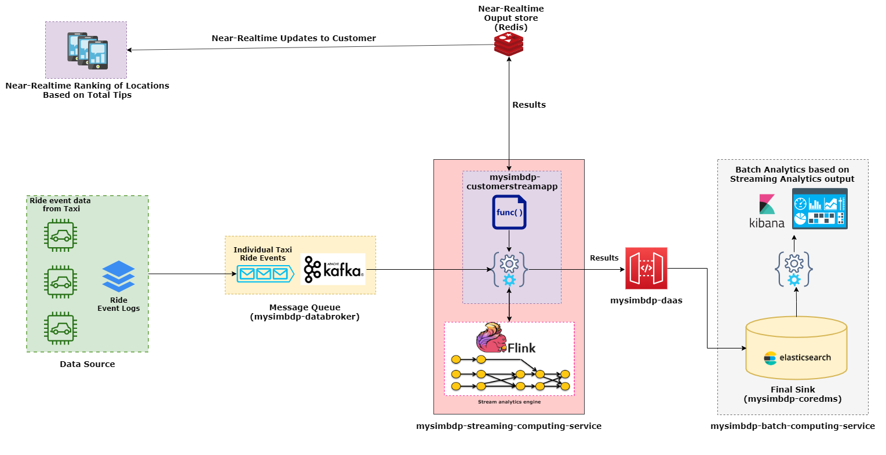

I want to compute max tips per 15 mins computed in every 5 mins, keyed by location id

When tip was maximum customer behavior

Incremental Aggegation to be more efficient, rather than buffering up events in a window

## Part 1: Design for Streaming Analytics

**Q1:** *Select a dataset suitable for streaming analytics for a customer as a running example (thus the basic unit of the data should be a discrete record/event data). Explain the dataset and at least two different analytics for the customer: (i) a streaming analytics which analyzes streaming data from the customer (customerstreamapp) and (ii) a batch analytics which analyzes historical results outputted by the streaming analytics.* 

**Answer:** 

I used the New York City (NYC) Taxi [dataset](https://www1.nyc.gov/site/tlc/about/tlc-trip-record-data.page) published by NYC Taxi and Limousine Corporation (TLC). 

Particularly, I have used the dataset for yellow taxi cabs for the month *January, 2019*. The data is available in CSV format, where **each row of the CSV file represents a taxi ride event** in NYC. 
The dataset that I have used here contains in total 18 fields of which we are mostly interested in the following fields - 

* **tpep_pickup_datetime** - When the meter was started
* **tpep_dropoff_datetime** - When the meter was disengaged
* **PULocationID** - Pickup location ID
* **tip_amount** - The amount of tip given by the passenger by credit card payment

(Note: A list of the explanation of each individal fields can be found [here](https://data.cityofnewyork.us/api/views/t29m-gskq/files/89042b9b-8280-4339-bda2-d68f428a7499?download=true&filename=data_dictionary_trip_records_yellow.pdf))

Previously, this dataset used to include the latitude and longitude of the pickup and dropoff locations, but in the latest versions they have removed these attributes. Instead they are providing locationID (1 through 263) from the pickup and dropoff locations as they have divided the whole NYC into 263 locations. However, a [geoJSON format](https://geo.nyu.edu/catalog/nyu-2451-36743) of the 263 zones can be found in the Spatial Data Repository of **New York University (NYU).**

**Streaming analytics:**

The taxi drivers might be interested in finding the pickup areas of those rides, where the passagers usually gives more **tips**. So, here I am going to develop a streaming analytics for the **taxi drivers (my customers)**, where they will be able to see the status quo of total tip amount paid by the passengers for the rides which started in these pickup location. So that, if they want, they can go to such places in the hope of earning more. 

To be more clear, the taxi drivers will be able see the top **n** (my customer defines the **n**) pickup locations which resulted into highest total tips, updating in near real-time.

**Batch analytics from the historical output of Streaming analytics:**

Here again my customers can see the pickup locations of the taxi rides which resulted into maximum tips. And as this analysis will be on the **bounded data**  generated by my streming analytics output, my customers will have the freedom of seeing this batch analytics results based on their specified time-frame (i.e. daily, weekly, monthly etc).

Moreover, I will plot the result of this batch analytics onto a **co-ordinate map**, to make this analytics intutive and easy to understand for my customers.

**Q2:** *Customers will send data through message brokers/messaging systems which become data stream sources. Discuss and explain the following aspects for the streaming analytics: (i) should the analytics handle keyed or non-keyed data streams for the customer data, and (ii) which types of delivery guarantees should be suitable.*

**Answer** 
**i.** The streaming analytics that I am implementing here should handle **keyed** data stream. Because, the analytics is going to calculate total amount tips of all the taxi rides starting from a particular pickup location. In order to calculate this, the data stream must be keyed by the pickup location id **(PULocationID)**, so that the incoming taxi ride events will be partioned by their **(PULocationID)** and the output of the streaming analytics for each of these locations will be calculated parallelly.

For example, in the diagram above, I am receiving the taxi ride events from the Kafka source and then passing it through the **keyBy Operator** which eventually allocates them to the **Window Operators**. In the diagram the taxi ride events R1 through R6 are colored according to their location ID. After passing through the keyBy Operator they are **partitioned** according to their pickup location ID and then they are passed to appropiate window operator. Then each of these window operators **materializes** the result of streaming analysis parallelly **when** at proper time (The discussion about timing of window matrialization is discussed in answer of question no. 3).

**ii.** **At-most-once** delivery guarantee should be suitable for my streaming analytics. Because, I don't really want to process a single taxi ride event multiple times and get a **false** high total_tip amount which might mislead the taxi drivers to choose wrong pick-up locations.

On the other hand, the events that I am handling in this analytics *is **not** something that actually requires At-least-once delivery guarantee*, because I want to provide the drivers an opportunity to earn more, but it is not something that will affect their normal earnings. Yes, they might earn more if I can provide the exact updated realtime analytics, but missing couple of taxi ride events won't hurt them as much as would if I process a single taxi ride event multiple times and produce a wrong (misleading) output.

But definately, my ultimate target is to provide exactly-once delivery. 

**Q3:** *Given streaming data from the customer (selected before). Explain the following issues: (i) which types of time should be associated with stream sources for the analytics and be considered in stream processing (if the data sources have no timestamps associated with events, then what would be your solution), and (ii) which types of windows should be developed for the analytics (if no window, then why). Explain these aspects and give examples.* 

**Answer** 
i. The particular streaming analytics in my case doesn't require consideration of *event time*. Because, in my streaming analytics I am computing the total amount of tip per location. Here, my customer (taxi drivers) are mostly interested in knowing starting location of the taxi rides which ends up resulting into maximum tips. 
Another notable issue in my analytics is that, the taxi ride event will not have  insteresting  But as I'm also storing the output of my streaming analysis output to a sink `mysimbdp-coredms` for future batch processing, so I am considering *event time* during my streaming analytics. Because, then the drivers will be able to find out the starting times of the 

ii. **Sliding windows** should be develped as my analytics will present the drivers with a regulargly updated status of the most rewarding locations. For, example my analytics will be computing max tips per 15 mins computed in every 5 mins. A new window will be created in every 5 mins, and each of this windows will contain the taxi ride events recieved in last 15 mins.....

overlap
Result materialization

**Q4**

..

...

..

**Q5** *Provide a design of your architecture for the streaming analytics service in which you clarify: customer data sources, mysimbdp message brokers, mysimbdp streaming computing service, customer streaming analytics app, mysimbdp-coredms, and other components, if needed.*

**Answer**

    

