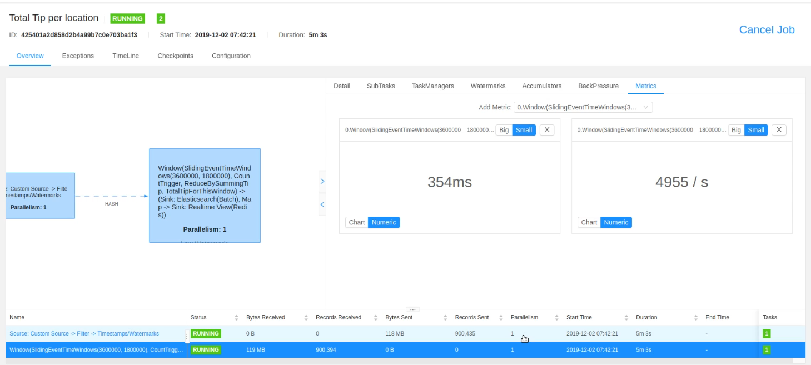
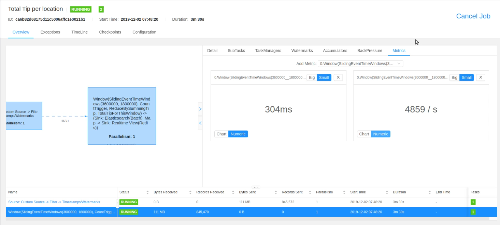
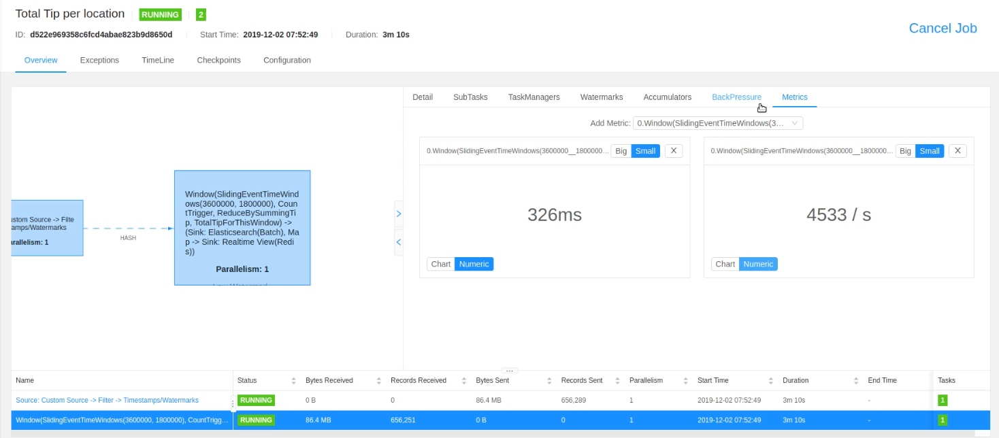

# Performance Observation of my Streaming Analytics

**Q4:** *Performance testing with wrong data stream*

**Test environment description:** 

| ENV Type  | Value |
| ------------- | ------------- |
| Parallelism  | 1 |
| No. of events  | 100000 |
| Window Type  | Sliding |
| Window Width  | 1 Hour|
| Window Period  | 30 mins|
|Machine Specs  | Core-i7 1065g7, 16 GB RAM  |

 | Metric | Error Rate (5%) |  Error Rate (10%) | Error Rate (15%) |
| ------------- | ------------- |------------- |  ------------- |
|Valid Event Processed | 950,000  | 900,000  | 833,334 |
|Sustained Latency | 354ms  | 304ms | 326ms |
|Maximum Throughput | 4955/s  | 4859/s | 4533/s |

* **Error Rate (5%):**

* **Error Rate (10%):**

* **Error Rate (15%):**

**Q5:** *Performance testing with various degree of paralellism*

As these test were run using different degrees of parallelism and the maximum throughput for each of the taskmanager peaked at different time so I am not providing any screenshots here. 

However, A video demo of the test with the aforementioned settings can be seen [here](https://www.youtube.com/watch?v=BWRgp-gHadc). The results are listed below. 

**Number of events 1,000,000:**

1. Parallelism = 1:
    

    | Metric | **TaskManager0** |
    | ------------- | ------------- |   
    |Sustained Latency | 409ms  |
    |Maximum Throughput | 5456/s  |

1. Parallelism = 2:
    

    | Metric | **TaskManager0** | **TaskManager1** |
    | ------------- | ------------- |------------- |   
    |Sustained Latency | 142ms  | 232ms |
    |Maximum Throughput | 2358/s  | 2898/s |

2. Parallelism = 4:

    | Metric | **TaskManager0** | **TaskManager1** | **TaskManager2** | **TaskManager3** |
    | ------------- | ------------- |------------- |------------- |------------- |
    |Sustained Latency | 114ms  | 36ms | 94ms | 143ms|
    |Maximum Throughput | 1667/s  | 663/s | 1107/s | 1743/s |

**Number of events 2,000,000:**

1. Parallelism = 1:
    

    | Metric | **TaskManager0** |
    | ------------- | ------------- |   
    |Sustained Latency | 469ms  |
    |Maximum Throughput | 5387/s  |

1. Parallelism = 2:
    

    | Metric | **TaskManager0** | **TaskManager1** |
    | ------------- | ------------- |------------- |   
    |Sustained Latency | 137ms  | 230ms |
    |Maximum Throughput | 2347/s  | 2909/s |

2. Parallelism = 4:

    | Metric | **TaskManager0** | **TaskManager1** | **TaskManager2** | **TaskManager3** |
    | ------------- | ------------- |------------- |------------- |------------- |
    |Sustained Latency | 134ms  | 45ms | 105ms | 161ms|
    |Maximum Throughput | 1676/s  | 670/s | 1108/s | 1757/s |

    From the tests above, it is clear that while for all of these test cases the combined throughput of all the taskmanagers almost remained same, the sustained latency kept improving as the degree of parallelism was increased. In case of 1,000,000 events it decreased from 409ms (for parallelism 1) to 142ms (minimum for parallelism 2) to 36ms (minimum for parallelism 4). Then, I ran the same test for 2,000,000 events to verify this trend, and these tests demonstrated the same behavior as well, where the latency went down from 469ms (for parallelism 1) to 137ms (minimum for parallelism 2) to 45ms (minimum for parallelism 4). It is also notable that, none of these test cases experienced any backpressure.
